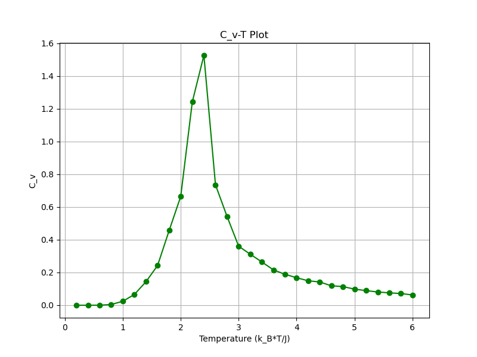
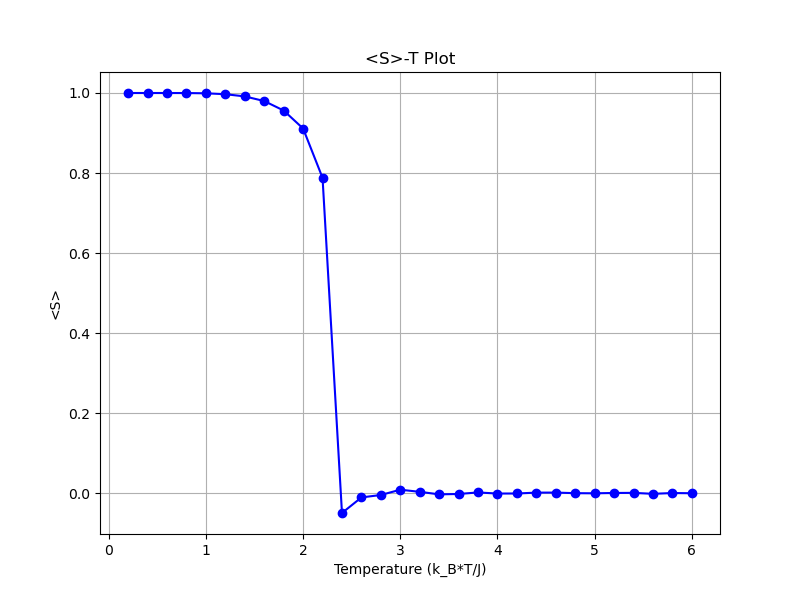
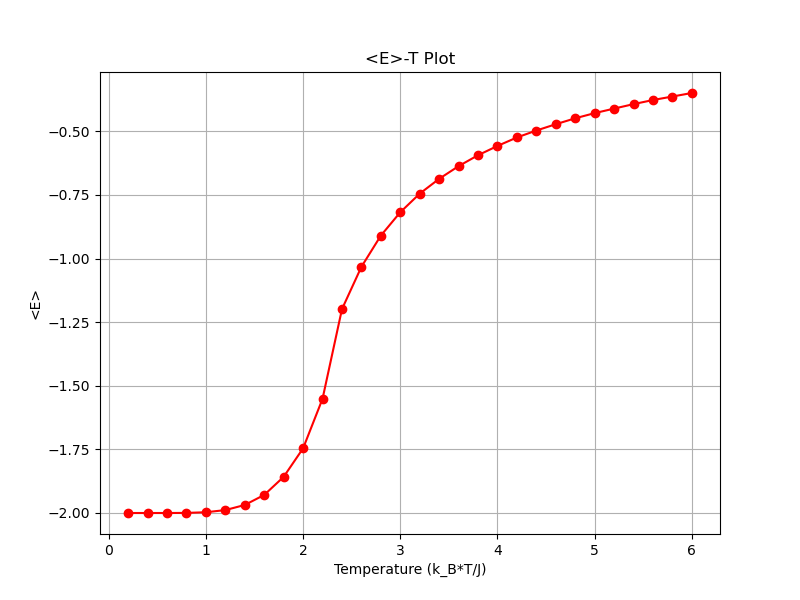

得到的结果如下：

三张图片都可以看到一个清晰的相变温度点：约化温度$k_BT/J\approx 2.3$，在三张图中，约化温度在2.2-2.4之间的时候都呈现出了巨大的变化：

- 热容在2.0-2.6之间出现了一个巨大的峰
- 平均磁矩一开始趋于1，有序排列，在2.2-2.4出现了巨大的下跌，之后磁矩趋于零，变为无序排列
- 平均能量在2.2-2.4之间的上升速度最快

因此，可以看到相变的约化温度约为2.3。